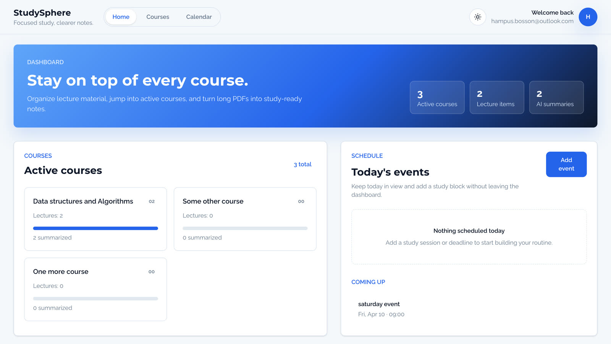
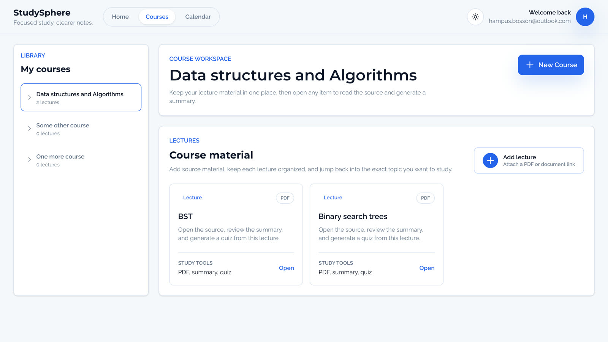
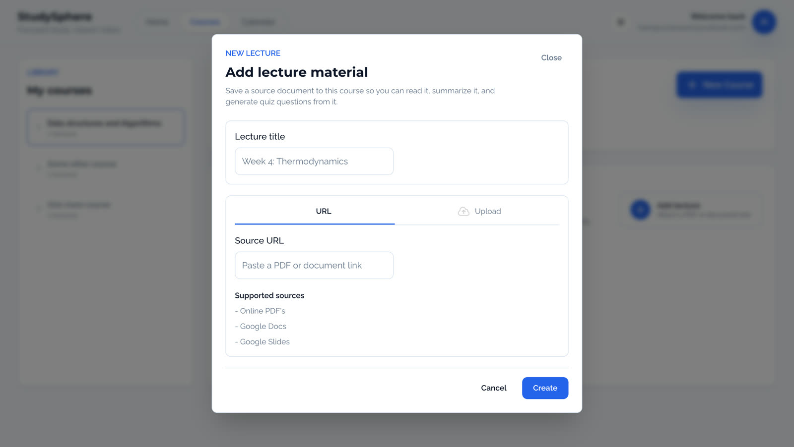
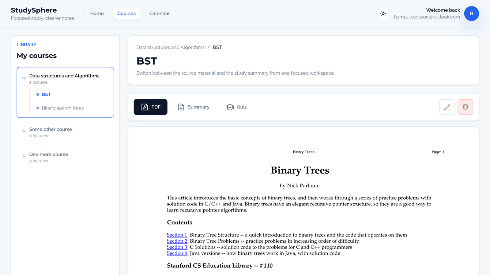
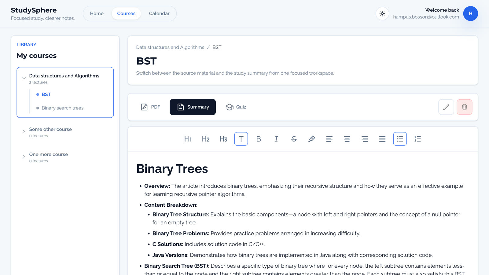
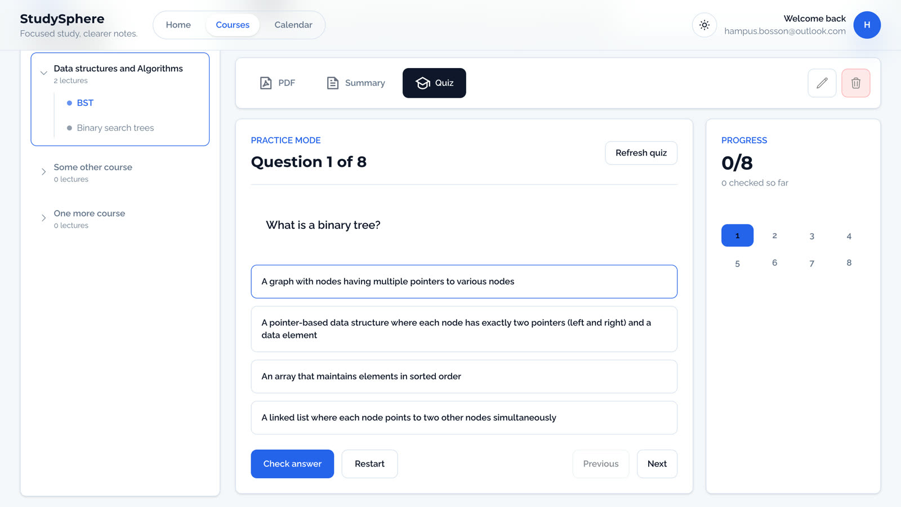
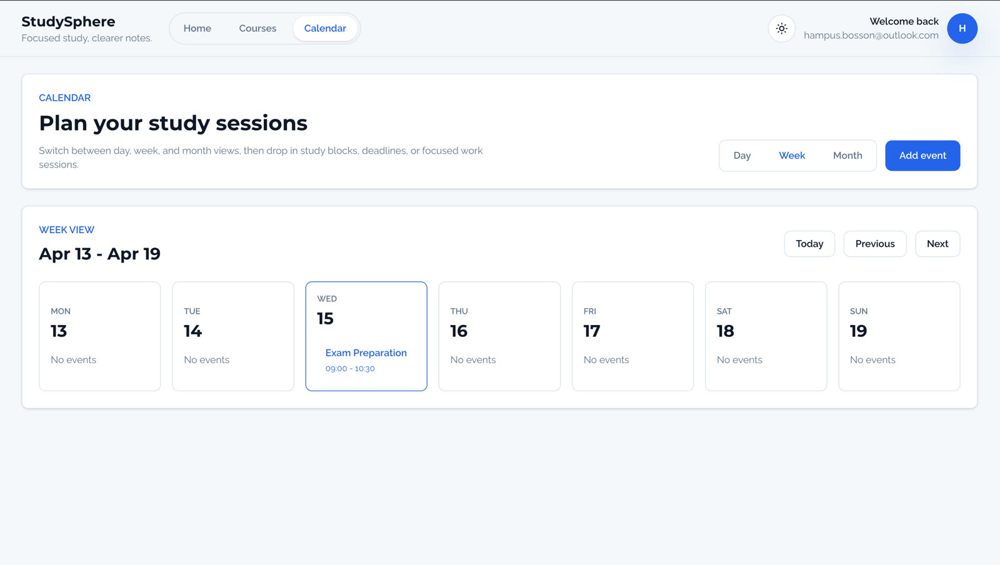

# StudySphere

StudySphere is a full-stack study companion for students who want one place to organize course material, read lecture PDFs, generate AI summaries, and practice with quiz questions.

This repository contains the full monorepo:

- `studysphere-app-frontend` - React + Vite frontend
- `studysphere-backend` - Express + Prisma backend
- `docker-compose.yml` - local development stack with PostgreSQL

## Highlights

- Email-based authentication with signup, login, verification, and password reset
- Course and lecture organization
- Lecture creation from external URLs
- In-app PDF viewing
- AI-generated lecture summaries
- Interactive quiz generation from lecture content
- Calendar workspace for planning study sessions
- Responsive UI with light and dark mode

## Demo

### Dashboard



### Courses Workspace



### Add Lecture



### PDF Viewer



### AI Summary



### Quiz Mode



### Calendar



## Tech Stack

**Frontend**

- React 18
- TypeScript
- Vite
- React Router
- React Query
- Tailwind CSS
- Tiptap
- React PDF

**Backend**

- Node.js
- Express
- TypeScript
- Prisma
- PostgreSQL
- JWT auth with cookies
- Nodemailer
- OpenAI API

## Running Locally With Docker

The easiest way to run the full app is with Docker.

### 1. Create the root environment file

Copy the example file:

```bash
cp .env.example .env
```

Then fill in the values:

```env
EMAIL_USER=your-email@gmail.com
EMAIL_PASS=your-app-password
JWT_SECRET=your-strong-secret
OPENAI_KEY=your-openai-key
```

Notes:

- `EMAIL_PASS` should be an app password if you are using Gmail SMTP.
- If you only want to test the UI and avoid summary/email flows, you can still start the stack without all optional values, but auth and AI features may not work correctly.

### 2. Start backend + database

```bash
docker compose up --build
```

This starts:

- PostgreSQL on `localhost:5432`
- Backend API on `http://localhost:3000`

### 3. Start the frontend

In a second terminal:

```bash
cd studysphere-app-frontend
npm install
npm run dev
```

The frontend runs on:

```text
http://localhost:5173
```

## Local Development Without Docker

If you prefer to run the backend manually:

### Backend

```bash
cd studysphere-backend
npm install
cp .env.example .env
npx prisma migrate dev
npm run dev
```

### Frontend

```bash
cd studysphere-app-frontend
npm install
npm run dev
```

You will also need a running PostgreSQL instance and a valid `DATABASE_URL` in `studysphere-backend/.env`.

## Project Structure

```text
study-app/
├── docker-compose.yml
├── README.md
├── studysphere-app-frontend/
│   ├── public/
│   └── src/
└── studysphere-backend/
    ├── prisma/
    └── src/
```

## Key Product Flow

The strongest current workflow in the app is:

1. Sign up or log in
2. Create or open a course
3. Add a lecture from a URL
4. Open the source PDF inside the app
5. Generate an AI summary
6. Review or practice with quiz questions

## What I Focused On In This Project

- Building a complete frontend/backend product rather than a UI-only demo
- Designing a workflow around real student study material
- Combining document ingestion, persistence, and AI-powered learning features
- Creating a polished interface that works in both light and dark mode
- Packaging the app into a monorepo with Docker for easier setup and demos

## Future Improvements

- Direct file uploads for lecture material
- Better production-ready email and auth configuration
- More advanced quiz controls and scoring
- More complete calendar scheduling workflows
- Automated tests across frontend and backend

## Author

Built by Hampus Bosson.
